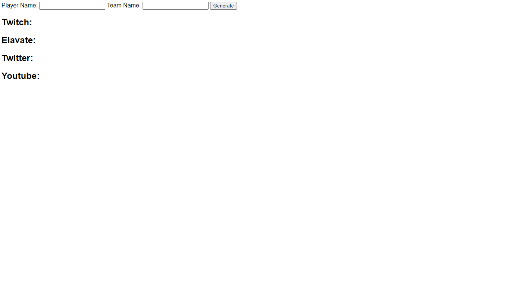

# Languages

- [Deutsche Version](#german)
- [English Version](#english)

--------------------------------------------------------------------------------------------------------

# German

## Social Graphics Library

### Einführung

Das **Social Graphics Library** Script nutzt `<canvas>`
zum generieren von von SVG, PNG, JPEG und WebP Grafiken für Community Team Mitglieder und Spieler.

### Support

Es besteht auch Support über den Discord Server des [WAPS-Framework](https://waps-framework.info), der Einladungslink ist [https://discord.gg/fraspbc](https://discord.gg/fraspbc)

### Aufbau

Zum generieren einer Grafik wird die statische Funktion `generator`
auf der Klasse `SocialGraphicsLibrary` aufgerufen:

    SocialGraphicsLibrary.generator(
        teamName,
        playerName,
        mode,
        containerId,
        imgMode
      );

Alternativ kann auch, sollten mehrere Grafiken generiert werden, die Methode `multiGenerator` aufgerufen werden:

        SocialGraphicsLibrary.multiGenerator(tName, pName, [{
                        mode: 'twitch-title',
                        containerId: 'img-container-1',
                        imgMode: 'jpeg'
                    }, {
                        mode: 'elavate-title',
                        containerId: 'img-container-2',
                        imgMode: 'jpeg'
                    }]

### Modifikatoren

- Team Name:
  - Der Team-Name
- Player Name:
  - Der Nutzer-Name
- Modus:
  - Der Modus des zu generierenden Bildes
    - youtube-title
      - Generiert ein Youtube Titelbild
    - twitch-title
      - Generiert ein Twitch Titelbild
    - twitter-title
      - Generiert ein Twitter Titelbild
    - elavate-title
      - Generiert ein Youtube Titelbild
    - gaming
      - Generiert ein Gaming Logo

- Container ID:
  - Gibt die ID des Containers an, welcher als Ziel für
      das generierte Bild dient

- Image Modus:
  - Der Modus des zu generierenen Bildes
    - png
    - svg
    - jpeg
    - webp

---

# English

## Social Graphics Library

### Introduction

The **Social Graphics Library** script uses `<canvas>`
to generate SVG, PNG, JPEG and WebP graphics for community team members and players.

### Support

There is also support via the Discord server of the [WAPS-Framework](https://waps-framework.info), the invitation link is [https://discord.gg/fraspbc](https://discord.gg/fraspbc)

### Structure

The static function `generator` is used to generate a graphic
called on the class `SocialGraphicsLibrary`:

    SocialGraphicsLibrary.generator(
        teamName,
        playerName,
        mode,
        containerId,
        imgMode
      );

Alternatively, if several graphics are to be generated, the `multiGenerator` method can be called:

        SocialGraphicsLibrary.multiGenerator(tName, pName, [{
                        mode: 'twitch-title',
                        containerId: 'img-container-1',
                        imgMode: 'jpeg'
                    }, {
                        mode: 'elavate-title',
                        containerId: 'img-container-2',
                        imgMode: 'jpeg'
                    }]

### Modifiers

- Team name:
  - The team name
- Player name:
  - The name of the player
- Mode:
  - The mode of the image to be generated
    - youtube-title
      - Generates a Youtube cover picture
    - twitch-title
      - Generates a Twitch cover photo
    - twitter-title
      - Generates a Twitter cover photo
    - elavate-title
      - Generates a Youtube cover picture
    - gaming
      - Generates a gaming logo

- Container ID:
  - Indicates the ID of the container which is the target for
       the generated image is used

- Image mode:
  - The mode of the image to be generated
    - png
    - svg
    - jpeg
    - webp

